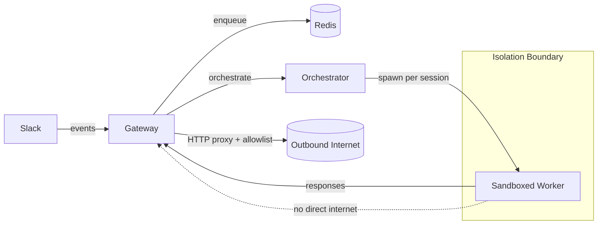

# Lobu

**Enterprise-ready, multi-tenant, sandboxed agent orchestration built on the OpenClaw runtime.** Lobu replaces OpenClaw gateway with a secure gateway you can plug in to your company chat.

## Interfaces:

**REST API**: Allows you to programmatically create OpenClaw instances to build your own applications. [See the API Docs](https://community.lobu.ai/api/docs)

**Slack**: Supports single bot to have different OpenClaws for each channel and DM. [Join the community Slack](https://join.slack.com/t/peerbot/shared_invite/zt-391o8tyw2-iyupjTG1xHIz9Og8C7JOnw) to try it.

**Telegram**: Lets you create personal AI assistants. Try it on [t.me/lobuaibot](t.me/lobuaibot). 

## Installation

### 1) Docker Compose (single host)

**Prereqs**: Docker Desktop, Slack app credentials, and a Claude Code OAuth token (or other configured model auth).

```bash
cp .env.example .env
# edit .env

# Build the worker image used for per-session sandboxes
make build-worker

# Start gateway + redis
docker compose up -d
```

Each agent runs on a container in your Docker deamon. Workers run on an internal Docker network with **no direct internet access**; outbound traffic goes through the gateway's HTTP proxy with domain filtering. See `SECURITY.md#docker-compose`.

### 2) Kubernetes (production)

**Prereqs**: `kubectl`, `helm`, and a cluster with a default StorageClass for per-session PVCs.

```bash
cp .env.example .env
# edit .env

make deploy
```

Security model (Kubernetes): workers run as isolated pods (optionally with stronger runtime **gVisor** or **Kata Containers** / microVMs (where available), are not externally reachable, and route egress through the gateway proxy. See `SECURITY.md#kubernetes`.

## How It Works



**Key concepts**
- **Multi-tenant by default**: different channels/DMs can run different models, tools, skills, Nix environments, and credentials safely.
- **Agent abstraction**: per-context configuration controls runtime/model/tools so the bot behaves differently in different places.
- **Gateway as single egress point**: workers route outbound traffic through the gateway, which enforces domain policy.

## Yet Another OpenClaw Copy?

I built and exited a B2B SaaS business (acquired by LiveRamp) and then started working on this full-time. Follow along: https://x.com/bu7emba

This project started in **July 2025** and was first published under [peerbot.ai](https://peeerbot.ai), initially focused on Claude Code. After OpenClaw is released, I added its runtime support so all OpenClaw skills can be used but Lobu has its own gateway system that replaces OpenClaw gateway. Here are the main differences:

1. Lobu OpenClaw workers **scale to zero** unlike Openclaw where you need to keep your computer open 7/24 even though you're not talking to your agent.
2. A single bot (Telegram / Slack user) can use different environment based on DMs and channels. That enables you to have a single Lobu instead of multiple OpenClaw instances.
3. Lobu supports Claude Code SDK for Claude models so Anthropic doesn't block your account.
4. Agents are strictly sandboxed, they can't talk to internet, or change gateway's environment. All access goes through the gateway and you configure where you want the agent to have access explicitly.

## Security And Privacy

- **No direct worker egress**: workers route outbound HTTP(S) via the gateway proxy, which enforces domain policy (allowlist/blocklist). (`SECURITY.md#network-egress`)
- **Secrets stay in the gateway**: MCP OAuth flows and provider credentials are handled by the gateway; workers never see MCP client secrets. (`SECURITY.md#mcp-oauth-and-credentials`)
- **Defense-in-depth on Kubernetes**: NetworkPolicies, RBAC, resource limits/quotas, and optional gVisor/Kata. (`SECURITY.md#kubernetes`)
- **Nix environments**: per-session environments can be activated using Nix (flake/packages) inside workers for reproducible tooling without baking everything into images. (`ARCHITECTURE.md#nix-environments`)
- **Skills**: curated skills support is available; treat skills as executable capability and apply policy accordingly. (`SECURITY.md#skills-and-policy`)

## License

Business Source License 1.1 (`BUSL-1.1`). See `LICENSE`.
